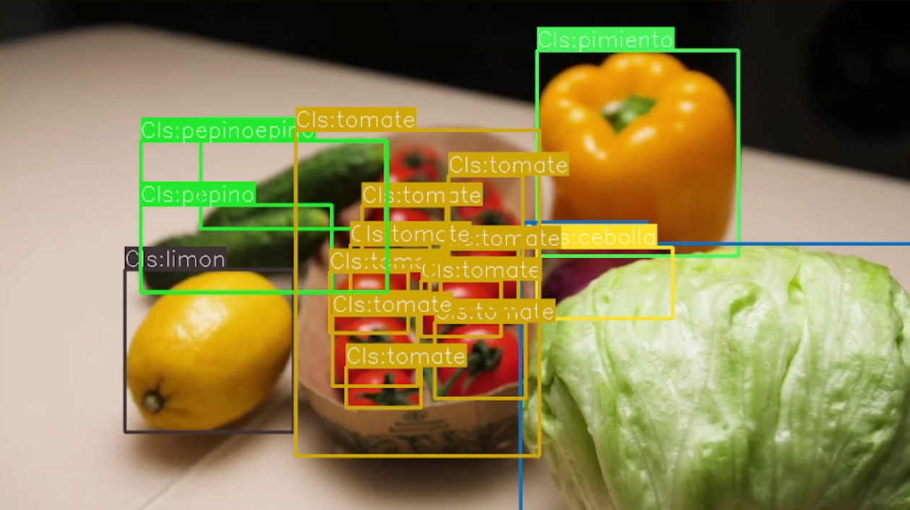
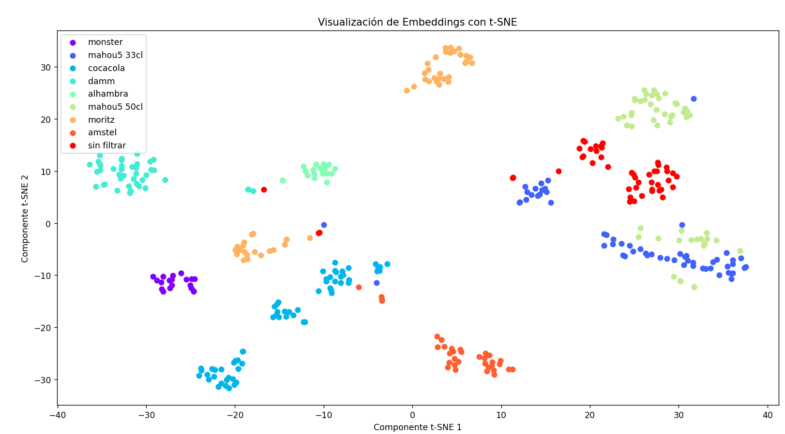
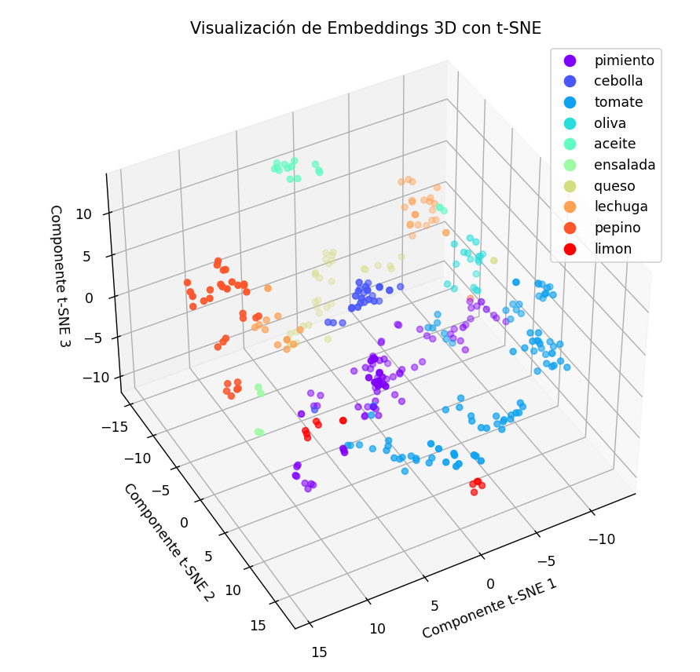
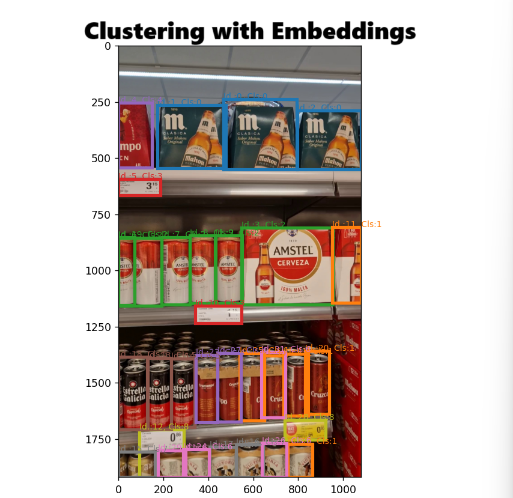

# Clasificación de Objetos con FastSAM y Embeddings

## Descripción General

Este proyecto presenta una solución de Computer Vision para la detección y clasificación de objetos en imágenes, las cuales son extraídas como frames de vídeos. Utiliza el modelo FastSAM para la detección de objetos, y para la clasificación, emplea embeddings que pueden ser generados mediante dos modelos distintos: CLIP o SigLIP. La comparación de embeddings se realiza a través de la similitud coseno o mediante el algoritmo KNN, proporcionando una estructura flexible y robusta para abordar diversos desafíos de clasificación en el campo de la visión por computadora.



El proyecto está estructurado en directorios específicos para mantener los datos, los modelos, la información de clasificación y los resultados de salida, asegurando así una organización y un flujo de trabajo claros. La carpeta `FastSAM` es esencial para el funcionamiento del modelo de detección, mientras que la carpeta `models` alberga los modelos de clasificación de embeddings necesarios.

## Preparación

### Descarga del Repositorio de FastSAM

Además de los pesos, es necesario descargar el código fuente de FastSAM desde su repositorio oficial:
``` git clone https://github.com/CASIA-IVA-Lab/FastSAM ```

Para usar el modelo FastSAM, es necesario descargar los pesos preentrenados. Sigue el siguiente enlace para descargar el archivo de pesos `FastSAM.pt` y colócalo dentro de la carpeta `models` de tu proyecto.

[Descargar pesos FastSAM](https://huggingface.co/spaces/An-619/FastSAM/resolve/main/weights/FastSAM.pt)

### Instalación

Para preparar el entorno necesario para ejecutar este proyecto, sigue los siguientes pasos:

1. Clona el repositorio en tu máquina local:
``` git clone https://github.com/alejandroolivo/ObjectClassification-with-fastSAM-and-embeddings.git ```

2. Navega al directorio del proyecto:
``` cd OBJECTCLASSIFICATION-WITH-FASTSAM-AND-EMBEDDINGS ```

3. (Opcional) Crea y activa un entorno virtual:
``` -m venv venv # Para activarlo, en Windows usa: venv\Scripts\activate ```

5. Instala pytorch con la info de su web oficial, con CUDA o no, según tus preferencias.

4. Instala las dependencias necesarias:
``` pip install -r requirements.txt ```

## Estructura del Proyecto

El proyecto tiene la siguiente estructura de carpetas y archivos:
```
OBJECTCLASSIFICATION-WITH-FASTSAM-AND-EMBEDDINGS

- core/ # Módulos principales del proyecto
    - DetectAndClassifyCLIP.py # Clase para la detección y clasificación con CLIP
    - DetectAndClassifySigLIP.py # Clase para la detección y clasificación con SigLIP

- data/ # Datos utilizados para ejemplos y pruebas

- examples/ # Scripts de ejemplo para demostrar el uso de los módulos core

- FastSAM/ # Código fuente y dependencias para el modelo FastSAM

- info/ # Documentación e información relevante

- models/ # Modelos entrenados, incluyendo pesos de FastSAM

- output/ # Salida generada por los scripts, como clasificaciones y visualizaciones

- utils/ # Herramientas de utilidad para operaciones generales como preprocesamiento
```

## Clases Core

El proyecto incluye dos clases core que son fundamentales para el proceso de detección y clasificación de objetos utilizando los modelos CLIP y SigLIP respectivamente. Estas clases son responsables de realizar la detección de objetos en imágenes, generando y comparando embeddings, y proporcionando las herramientas necesarias para clasificar los objetos detectados.

### `DetectAndClassifyCLIP.py`
Esta clase se encarga de la detección de objetos utilizando el modelo FastSAM y la clasificación mediante la generación de embeddings con el modelo CLIP. La clase ofrece métodos para detectar bounding boxes en imágenes, filtrar estos bounding boxes según ciertos criterios, y clasificar los objetos detectados utilizando la similitud coseno o el algoritmo KNN. Además, la clase proporciona funcionalidades para guardar imágenes anotadas y recortadas, mostrar las bounding boxes en la imagen, calcular y guardar embeddings para un conjunto de clases, y realizar el clustering de los objetos detectados para su análisis.

Un ejemplo de uso es el siguiente:

```python
# Inicializar la clase con la ruta al modelo FastSAM
detector_classifier = DetectAndClassifyCLIP(model_path='models/FastSAM.pt')

# Detectar objetos en una imagen
boxes, annotations, prompt_process = detector_classifier.detect_boxes(image_path='path/to/image.jpg')

# Clasificar los objetos detectados y guardar los resultados
class_labels, class_indices = detector_classifier.classify_crops(crops, embeddings)
```

### `DetectAndClassifySigLIP.py`
Esta clase tiene un propósito similar a DetectAndClassifyCLIP.py pero utiliza el modelo SigLIP para la generación de embeddings. Los métodos disponibles en esta clase son equivalentes en funcionalidad y proporcionan las mismas operaciones de detección y clasificación ajustadas para trabajar con los embeddings generados por SigLIP.


## Visualizaciones de Embeddings

El proyecto incluye una serie de visualizaciones que ayudan a entender cómo los embeddings pueden agrupar los objetos detectados en el espacio de características.

### Visualización 2D de t-SNE


### Visualización 3D de t-SNE


## Ejemplos

La carpeta `examples` contiene varios scripts de Python que sirven como ejemplos prácticos de cómo utilizar las clases core y las funcionalidades de detección y clasificación de objetos en diversas situaciones:

### `CreateEmbeddings_ObjectClassificationCLIP.py`
Muestra cómo generar y almacenar embeddings de objetos utilizando el modelo CLIP. Este proceso es esencial para la clasificación y el análisis posterior de los objetos detectados.

### `CreateEmbeddings_ObjectClassificationSigLIP.py`
Similar al script anterior pero utilizando el modelo SigLIP para la generación de embeddings. Este script es crucial para aquellos que deseen utilizar SigLIP en lugar de CLIP para sus tareas de clasificación.

### `FastSAMFullExample.py`
Proporciona un ejemplo completo de cómo utilizar el modelo FastSAM para la detección de objetos en imágenes. Es un punto de partida excelente para comprender el flujo de trabajo completo de detección con FastSAM.

### `FewShotObjectClassificationCLIP_VIDEO.py`
Demuestra cómo implementar la clasificación de objetos con pocos ejemplos (few-shot classification) en vídeos utilizando CLIP. Este script es particularmente valioso para situaciones en las que se dispone de un conjunto limitado de datos de entrenamiento.

### `FewShotObjectClassificationSigLIP_VIDEO.py`
Realiza tareas de clasificación de objetos con pocos ejemplos en vídeos, pero utilizando el modelo SigLIP. Es ideal para comparar la eficacia de SigLIP frente a CLIP en escenarios de few-shot learning.

### `SigLIPEmbeddingsVisualization.py`
Este script está diseñado para visualizar los embeddings generados por SigLIP, lo que ayuda a obtener una comprensión más profunda de cómo los objetos se agrupan en el espacio de características.

### `ZeroShotObjectClassification.py`
Ilustra cómo realizar clasificación de objetos sin necesidad de ejemplos previos (zero-shot classification) utilizando embeddings. Es un caso de uso avanzado para escenarios donde no se dispone de datos etiquetados para entrenamiento.



### `ClipAndMLPTraining.py`
Este script demuestra cómo se pueden entrenar modelos Multi-Layer Perceptron (MLP) utilizando los embeddings generados por el modelo CLIP. Es útil para entender cómo los embeddings pueden ser utilizados para entrenar clasificadores adicionales.